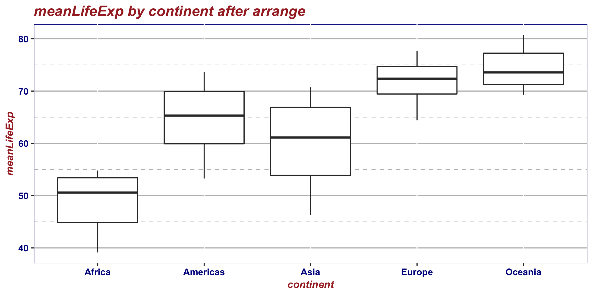
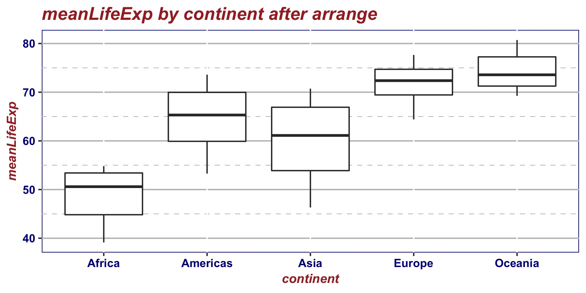

```{r setup, include=FALSE}
knitr::opts_chunk$set(echo = TRUE)
```

```{r}
suppressPackageStartupMessages(library(tidyverse))
suppressPackageStartupMessages(library(scales))
suppressPackageStartupMessages(library(plotly))
library(gapminder)
library(ggplot2)
suppressPackageStartupMessages(library(gridExtra))
library(grid)
library(forcats)
#devtools::install_github("haozhu233/kableExtra")# html kable theme setup
suppressPackageStartupMessages(library(kableExtra))

```

# 0. Introduction 
This assignment aim to practice some factor management skills ,writing dataset and figures.

# 1. Factor Management 
In this section, I will be using `gapminder` as the dataset to explore those factor features.
## 1.1 Drop factors/levels

## Drop Oceania

The task discription:

> Filter the Gapminder data to remove observations associated with the continent of Oceania. Additionally, remove unused factor levels. Provide concrete information on the data before and after removing these rows and Oceania; address the number of rows and the levels of the affected factors.

Before we drop Oceania, let us see the levels in `continent`.

```{r}
# original levels in continent
gapminder$continent %>% 
  fct_count() %>% # count all levels in continent 
  knitr::kable(col.names = c("Countries","Counts"), 
               format = "html", 
               booktaps = TRUE,
               padding = 2,
               align = "c") %>% 
   kable_styling(bootstrap_options = "striped", full_width = F)
  
```

Then I will filter out Oceania from continent and compare those two datasets.

```{r}
# drop Oceania from continent 
gap_no_Oce = gapminder %>% 
  filter(continent != "Oceania")
# to see the levels in continent 
gap_no_Oce$continent %>% fct_count() %>% # count all levels in continent without oceania 
  knitr::kable(col.names = c("Factors","Counts"), 
               format = "html", 
               booktaps = TRUE,
               padding = 2,
               align = "c") %>% 
   kable_styling(bootstrap_options = "striped", full_width = F)
```

we can see that except for Onceania, other levels are untouched. Now I am going to remove unused levels(i.e. Oceania in `gap_no_Oce`)

```{r}
#drop extra levels
gap_drop_Oce = gap_no_Oce %>% 
  droplevels()
# to see the levels
gap_drop_Oce$continent %>% fct_count() %>% # count all levels in continent without oceania after droping 
  knitr::kable(col.names = c("Countries","Counts"), 
               format = "html", 
               booktaps = TRUE,
               padding = 2,
               align = "c")  %>% 
   kable_styling(bootstrap_options = "striped", full_width = F)

```

Finally, I will compare the number of rows of those 3 datasets.
```{r}
#printing the number of rows of 3 datasets
(c(nrow(gapminder),nrow(gap_no_Oce),nrow(gap_drop_Oce)))
```

I will also display by using a table. I'll rbind 3 `fct_count` results and using a group table to show  the comparison result.

```{r}
# rbind 3 tables
t1 = gapminder$continent %>% fct_count()
t2 = gap_no_Oce$continent %>% fct_count()
t3 = gap_drop_Oce$continent %>% fct_count()
t_compare = rbind(t1,t2,t3) 
#pip into kable fucntion
t_compare %>% 
  kable(col.names = c("Countries","Counts"), 
               format = "html", 
               booktaps = TRUE,
               padding = 2,
              capiton = "result comparison",
              align = "c")  %>% 
   kable_styling(bootstrap_options = "striped", full_width = F) %>%
  group_rows(index = c("Gapminder"=(nrow(t1)),"gap_no_Oce"=nrow(t2),"gap_drop_Oce"=nrow(t3)),label_row_css = "background-color: #666; color: #fff;") %>%
  scroll_box(width = "900px", height = "250px")

```


## Reorder the level of `country` and `continent`

The task discription:

> Use the forcats package to change the order of the factor levels, based on a principled summary of one of the quantitative variables. Consider experimenting with a summary statistic beyond the most basic choice of the median.

I will reorder the continent by the IQR of `gdpPercap` and comparing two plots to see the chang of order in continents. 

```{r,fig.align = "center"}
#plot after reorder by mean
plot1 = gapminder %>%
    mutate(continent = fct_reorder(continent, gdpPercap, IQR)) %>%
    ggplot(aes(continent, gdpPercap)) +
    geom_violin(fill="cornflowerblue")+
    geom_boxplot(fill= "lightblue",width=0.5,alpha=0.5,notch=TRUE)+
    geom_jitter(col="#0353A4", alpha= 0.1)+
    theme_bw()+
    labs(title="gdp change by year after reorder")
#plot before reorder
plot2 = gapminder %>%
    group_by(continent) %>% 
    ggplot(aes(continent, gdpPercap)) +
    geom_violin(fill="cornflowerblue")+
    geom_boxplot(fill= "lightblue",width=0.5,alpha=0.5,notch=TRUE)+
    geom_jitter(col="#0353A4", alpha= 0.1)+
    theme_bw()+
    labs(title="gdp change by year before reorder")
#put 2 plot together
grid.arrange(plot2,plot1,ncol = 2)
    
```

But if we use `arrange` here, the order of factors won't change.

```{r,fig.align = "center"}
# arrange mean life expectancy
gapminder %>%
    group_by(continent) %>%
    summarise(meanLifeExp = mean(lifeExp)) %>%
    arrange(desc(continent)) %>%
    knitr::kable(format= "html", align = "c") %>% 
  kable_styling(bootstrap_options = "striped", full_width = F)
  

# boxplot after arrage
gapminder %>%
    group_by(continent, year) %>%
    summarise(meanLifeExp = mean(lifeExp)) %>%
    arrange(desc(continent)) %>%
    ggplot(aes(continent, y = meanLifeExp)) +
    geom_boxplot(fill= "lightblue",width=0.5,alpha=0.5)+
    theme_bw()+
    labs(title="meanLifeExp by continent after arrange")
```

# 2. File I/O

Task discription:

> Experiment with one or more of `write_csv()`/`read_csv()` (and/or TSV friends), `saveRDS()`/`readRDS()`, `dput()`/`dget()`. Create something new, probably by filtering or grouped-summarization of Singer or Gapminder. I highly recommend you fiddle with the factor levels, i.e. make them non-alphabetical (see previous section). Explore whether this survives the round trip of writing to file then reading back in.

I am going to create a new factorial variable `ecoLevel` by comparing the worldwide mean of  `gdpPercap`. I will filter all the data in 2007 to simply the dataset. 
```{r}
# to see the years factors
as.factor(gapminder$year) %>% fct_count() %>%  
  kable(col.names = c("Year","Counts"), 
               format = "html", 
               booktaps = TRUE,
               padding = 2,
              capiton = "result comparison",
              align = "c")  %>% 
  kable_styling(bootstrap_options = "striped", full_width = F) %>% 
  scroll_box(width = "900px", height = "250px")
              
  

# filter out data in 2007
gap_2007 = gapminder %>% 
  filter(year== 2007)

# creating ecoLevel
gap_07eco = gap_2007 %>% 
  mutate(ecoLevel= factor(ifelse(gdpPercap>mean(gdpPercap),
                                             "high",
                                             "low")))
```

The write and read the data.

```{r}
write_csv(gap_07eco,"./excercise_file/gap_with_ecolevel.csv", append =FALSE, col_names = TRUE)
read_csv("gap_with_ecolevel.csv") %>% str()

```


# 3. Visualization Design

Task discription:

> Remake at least one figure or create a new one, in light of something you learned in the recent class meetings about visualization design and color. Maybe juxtapose your first attempt and what you obtained after some time spent working on it. Reflect on the differences. If using Gapminder, you can use the country or continent color scheme that ships with Gapminder.

I am going to explore the `theme` function in the former boxplot.
```{r,fig.align='center'}
# original plot
p1= gapminder %>%
    group_by(continent, year) %>%
    summarise(meanLifeExp = mean(lifeExp)) %>%
    arrange(desc(continent)) %>%
    ggplot(aes(continent, y = meanLifeExp)) +
    geom_boxplot()


# creating my theme

mytheme = theme(plot.title = element_text(face="bold.italic",size= 14,color="brown"),
                axis.title=element_text(face="bold.italic",size=10, color = "brown"),
                axis.text=element_text(face="bold",size=9, color = "darkblue"),
                panel.background = element_rect(fill="white",color="darkblue"),
                panel.grid.major.y = element_line(color="grey",linetype = 1),
                panel.grid.minor.y = element_line(color="grey",linetype = 2),
                panel.grid.minor.x = element_blank(),legend.position = "top")

# newplot
p2 = p1 +labs(title="meanLifeExp by continent after arrange")+
  mytheme
p2
```

comparing to the former one:
```{r,fig.align='center',fig.width= 10}
grid.arrange(p1,p2,ncol=2)
```

> Then, make a new graph by converting this visual (or another, if you’d like) to a plotly graph. What are some things that plotly makes possible, that are not possible with a regular ggplot2 graph?

```{r,fig.align='center'}
ggplotly(p2)
```
we can see that in `plotly` plots, there are some interactions.

we can add more dynamic interactions into `plotly`. For `ggplot2` to show the following one is kind difficult since there are too many dots clap together, but the `plotly` can make it interesting and you can even play it, to see the changes by year.

```{r,fig.align='center'}
#ggplot2
p3 = gapminder %>% 
  ggplot(aes(gdpPercap, lifeExp, color = continent, frame = year)) +
  geom_point(aes(size = pop),alpha= 0.3) +
  geom_smooth(se = FALSE,method="lm",size=0.5) +
  scale_radius(labels = comma_format())+
  scale_x_log10(labels= dollar_format())+
  scale_y_continuous(breaks=10*(1:10)) +
  theme_bw()+
  theme(plot.title = element_text(face="bold.italic",size= 14,color="brown"))+
  labs(title = "GdpPercap V.S. LifeExp ")
p3
#plotly animation
plotly::ggplotly(p3) %>% 
  plotly::highlight("plotly_hover")
```

# 4. writing figures to file


We can save the `p2` into `png/pdf/jpeg` file by using `ggsave`, notice that  if we don't point out the exact plot, `ggsave` will save the *last plot* drawn by default.

```{r}
# to save plot in png
ggsave("./excercise_file/mytheme.png", plot= p2,width = 8, height = 4, dpi="retina")
#to save plot in pdf
ggsave("./excercise_file/mytheme.pdf", plot= p2, width = 8, height = 4,scale= 0.5)
# in jpeg
ggsave("./excercise_file/mytheme.jpeg", plot=p2, width = 8, height = 4,scale= 0.8)
```

Now reload to see the plot:





# 5. But I want to do more!

In this section, I will choose several countries from `gapminder` and project thhe country into its caitals.

```{r}
gapminder %>% 
  filter(country %in% c("China",
                        "Canada",
                        "United Kingdom",
                        "Australia",
                        "United States",
                        "Italy")) %>% 
  droplevels() %>% 
  mutate(capitals = fct_recode(country,
                               Beijing = "China",
                               Ottawa = "Canada",
                               London = "United Kingdom",
                               Sydney = "Australia",
                               Washington = "United States",
                               Rome = "Italy")) %>% 
  pull(capitals) %>% fct_count() %>% 
  kable(align = "c",caption = "Levels of capital",
        col.names = c("Capitals","Counts")) %>% 
  kable_styling(bootstrap_options = "striped", full_width = F)
```


# Refenrences
1. [Create Awesome HTML Table with knitr::kable and kableExtra](https://cran.r-project.org/web/packages/kableExtra/vignettes/awesome_table_in_html.html)

2. [`plotly` animation](https://plot.ly/r/animations/#version-check)
