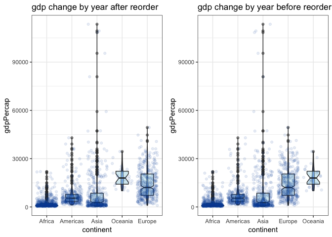
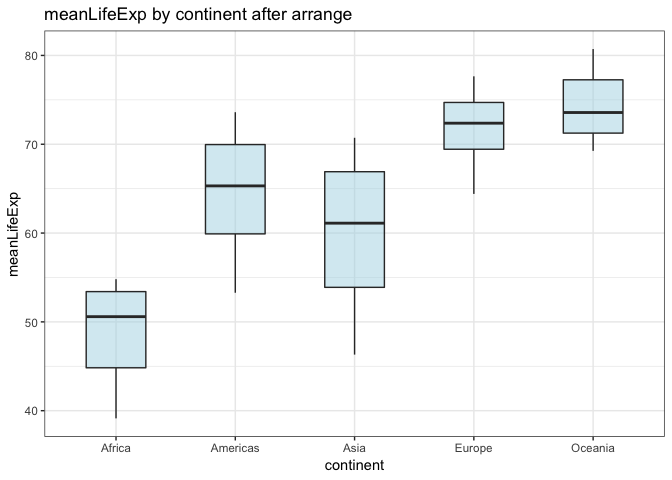

Hw05\_factor\_figure\_management
================
Zuheng(David) Xu
2018-10-19

``` r
suppressPackageStartupMessages(library(tidyverse))
suppressPackageStartupMessages(library(scales))
suppressPackageStartupMessages(library(plotly))
library(gapminder)
library(ggplot2)
library(gridExtra)
```

    ## 
    ## Attaching package: 'gridExtra'

    ## The following object is masked from 'package:dplyr':
    ## 
    ##     combine

``` r
library(grid)
library(forcats)
```

0. Introduction
===============

This assignment aim to practice some factor management skills ,writing dataset and figures.

1. Factor Management
====================

In this section, I will be using `gapminder` as the dataset to explore those factor features. \#\# 1.1 Drop factors/levels

Drop Oceania
------------

The task discription: &gt; Filter the Gapminder data to remove observations associated with the continent of Oceania. Additionally, remove unused factor levels. Provide concrete information on the data before and after removing these rows and Oceania; address the number of rows and the levels of the affected factors.

Before we drop Oceania, let us see the levels in `continent`.

``` r
# original levels in continent
gapminder$continent %>% 
  fct_count() %>% # count all levels in continent 
  knitr::kable(col.names = c("Countries","Counts"), 
               format = "markdown", 
               booktaps = TRUE,
               padding = 0)
```

| Countries |  Counts|
|:----------|-------:|
| Africa    |     624|
| Americas  |     300|
| Asia      |     396|
| Europe    |     360|
| Oceania   |      24|

Then I will filter out Oceania from continent and compare those two datasets.

``` r
# drop Oceania from continent 
gap_no_Oce = gapminder %>% 
  filter(continent != "Oceania")
# to see the levels in continent 
gap_no_Oce$continent %>% fct_count() %>% # count all levels in continent without oceania 
  knitr::kable(col.names = c("Factors","Counts"), 
               format = "markdown", 
               booktaps = TRUE,
               padding = 0)
```

| Factors  |  Counts|
|:---------|-------:|
| Africa   |     624|
| Americas |     300|
| Asia     |     396|
| Europe   |     360|
| Oceania  |       0|

we can see that except for Onceania, other levels are untouched. Now I am going to remove unused levels(i.e. Oceania in `gap_no_Oce`)

``` r
#drop extra levels
gap_drop_Oce = gap_no_Oce %>% 
  droplevels()
# to see the levels
gap_drop_Oce$continent %>% fct_count() %>% # count all levels in continent without oceania after droping 
  knitr::kable(col.names = c("Countries","Counts"), 
               format = "markdown", 
               booktaps = TRUE,
               padding = 0)
```

| Countries |  Counts|
|:----------|-------:|
| Africa    |     624|
| Americas  |     300|
| Asia      |     396|
| Europe    |     360|

Finally, I will compare the number of rows of those 3 datasets.

``` r
#printing the number of rows of 3 datasets
(c(nrow(gapminder),nrow(gap_no_Oce),nrow(gap_drop_Oce)))
```

    ## [1] 1704 1680 1680

Reorder the level of `country` and `continent`
----------------------------------------------

The task discription: &gt; Use the forcats package to change the order of the factor levels, based on a principled summary of one of the quantitative variables. Consider experimenting with a summary statistic beyond the most basic choice of the median.

``` r
gapminder %>%
    mutate(continent = fct_reorder(continent, gdpPercap, IQR)) %>%
    ggplot(aes(continent, y = gdpPercap, colour = continent)) +
    geom_boxplot() +
    theme_bw()
```



``` r
plot1 <- gapminder %>% 
  ggplot(aes(year, gdpPercap, colour = continent))+ 
  geom_point()+
  geom_line()+
  theme_bw()


plot2 = gap_drop_Oce %>% 
  ggplot(aes(year, gdpPercap, colour = continent))+ 
  geom_point()+
  geom_line()+ 
  theme_bw()+
  ggtitle("Plot for gdpPercap per year \n - reordering")

plot3 = gap_no_Oce %>% 
  ggplot(aes(year, gdpPercap, colour = continent))+ 
  geom_point()+
  geom_line()+ 
  theme_bw()+
  ggtitle("Plot for gdpPercap per year \n - arranging")

grid.arrange(plot1,plot2,plot3,ncol = 3)
```


